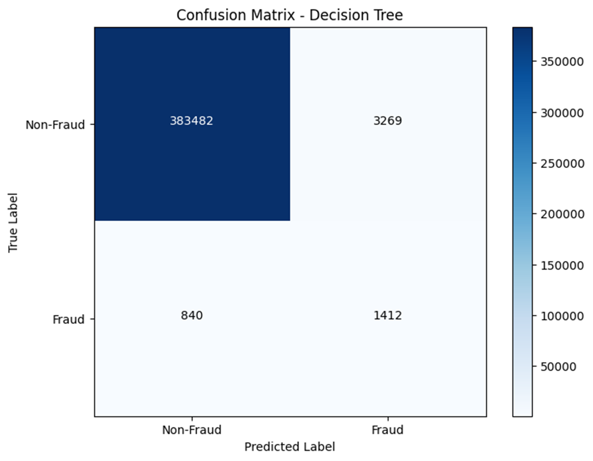
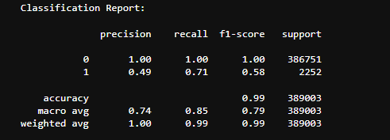
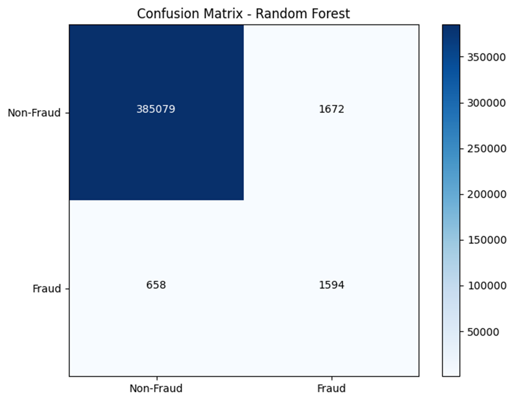

# ANALYSIS

## Introduction

When I first started this project, I noticed that many contributors on Kaggle threads were using decision trees and claiming to achieve 99% accuracy. This initially made me feel confident about the project. However, upon reviewing their code, I identified a significant issue: none of them included a confusion matrix in their posts and focused solely on accuracy. Given the dataset of 1.2 million entries, with only 7,500 fraudulent entries (approximately 0.58% of the total), it is possible to get all the fraud entries wrong and still achieve 99% accuracy. This realization led me to consider other metrics such as precision and recall, and to pay closer attention to the confusion matrix for my models.

## Decision Tree

I decided to start with a decision tree to see if I could effectively classify fraud cases while maintaining high accuracy. However, I encountered significant problems due to the propensity of decision trees to overfit. With the massive imbalance in the data, the decision tree struggled to classify fraud versus non-fraud cases accurately. My model correctly classified fraud cases only 31% of the time, which was a major issue.

## Random Forest

Inspired by a student's thesis from the Rochester Institute of Technology on machine learning for fraud detection, I experimented with a random forest model. The thesis discussed the use of random forest models with cross-validation, so I decided to focus exclusively on a random forest model. After training my new model, I observed a significant improvement in its ability to classify the fraud class. The accuracy increased from 31% with the decision tree to approximately 65% with the random forest model. My next step involved adjusting the model's threshold to see if it would yield further improvements. After several adjustments, the best outcome I achieved was the model correctly classifying 71% of the fraud entries.

## Challenges, Limitations, and Improvements

### Threshold Adjustments

Adjusting the threshold of the model's predictions posed a challenge. Setting the threshold too high resulted in fraud entries being classified as non-fraud, while setting it too low led to some non-fraud entries being misclassified as fraud. From the perspective of a financial institution, it is preferable to have a model that errs on the side of caution by labeling non-fraud entries as fraud rather than missing actual fraud cases due to the higher risk associated with the latter.

### Experience and Expertise

A key limitation of this project is my limited experience in handling significantly imbalanced datasets and my lack of professional experience. Fraud detection is a specialized field that presents unique challenges requiring expert knowledge and skills.

### Future Improvements

For future improvements, I am considering incorporating cross-validation into my model, as recommended in the Rochester thesis. Additionally, I would like to deepen my understanding of neural networks and explore their application in projects like this. However, my primary concern with neural networks is their tendency to overfit more than random forest models. In the neural network I experimented with, I implemented dropout to mitigate overfitting, but even then, the random forest model still outperformed the neural network.

---
